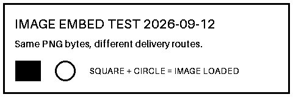

# Image delivery compatibility probe

This public, non-sensitive PNG is a transport fixture, not a scientific figure.

- Dimensions: 480 x 160 pixels.
- SHA-256: d37e0f69624aa388eff68308bbde229f24f5c39afda5f4df18b43aa2b75965cd
- Compare native PNG attachment output with assistant Markdown embedding of the same PNG.
- A valid file or successful upload does not establish visibility in a particular chat client.
- IPython Image(data=...) and Image(filename=...) emit image/png. Image(url=...) defaults to an HTML external reference, not embedded PNG bytes.
- Product UI visibility must be recorded separately for ChatGPT web, Codex Desktop chat, and Markdown-file preview.
